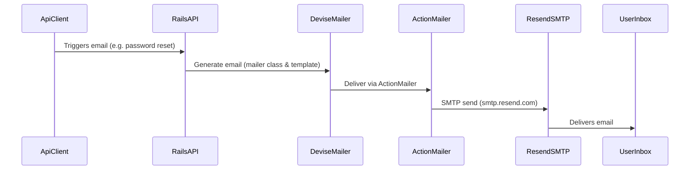

# Resend SMTP integration and gem overview

## Current app & gem overview

- **Rails**: API-only Rails 8 app using PostgreSQL, Devise + JWT for authentication, and the "Solid" stack for caching, jobs, and Action Cable.
- **Authentication**:
  - `User` model uses Devise with `:database_authenticatable`, `:registerable`, `:recoverable`, `:validatable`, and `:jwt_authenticatable` with `JwtDenylist` (`app/models/user.rb`, `app/models/jwt_denylist.rb`).
  - Custom Devise controllers for JSON responses: `Users::SessionsController` and `Users::RegistrationsController` (`app/controllers/users/...`).
  - JWT verification and expiration handled via `devise-jwt` config in `config/initializers/devise.rb` and custom `JwtExpirationCheck` middleware (`app/middleware/jwt_expiration_check.rb`).
- **API structure**:
  - Authenticated resources: `ExercisesController`, `WorkoutsController`, `WorkoutSetsController`, `AuthController` (all inherit from `ApplicationController < ActionController::API`).
  - Routes in `config/routes.rb` wire Devise (`/login`, `/logout`, `/signup`) and API resources plus `GET /auth/verify`.

### Non-Rails gems: what, why, and where

**Runtime / application gems**

- **`pg`**
  - **Why**: PostgreSQL adapter for Active Record.
  - **Where used**: Indirectly via `config/database.yml` and all models inheriting from `ApplicationRecord`; no direct `PG` calls in app code.

- **`puma`**
  - **Why**: HTTP app server for Rails.
  - **Where used**: Configured in `config/puma.rb`; used when running `bin/rails server` and in the Docker image (Puma is the default server that Thruster wraps).

- **`tzinfo-data`**
  - **Why**: Time zone data for Windows/JRuby; safe no-op on other platforms.
  - **Where used**: Implicitly by Active Support time zone features; no explicit references.

- **`solid_cache`**
  - **Why**: Durable cache store so you can avoid in-memory cache loss across deploys.
  - **Where used**: `config/environments/production.rb` sets `config.cache_store = :solid_cache_store`.

- **`solid_queue`**
  - **Why**: Database-backed job queue for Active Job.
  - **Where used**:
    - `config/environments/production.rb`: `config.active_job.queue_adapter = :solid_queue` and `config.solid_queue.connects_to = { database: { writing: :queue } }`.
    - `config/puma.rb`: `plugin :solid_queue if ENV["SOLID_QUEUE_IN_PUMA"]` to run the queue supervisor inside Puma when configured (see `config/deploy.yml` `SOLID_QUEUE_IN_PUMA` env var).

- **`solid_cable`**
  - **Why**: Database-backed Action Cable (websocket) backend for horizontal scalability.
  - **Where used**: `config/cable.yml` configures the `production` environment to use the `solid_cable` adapter and connect to the `:cable` database; Rails will use this for production websockets.

- **`bootsnap`**
  - **Why**: Speeds up boot time by caching compiled Ruby and YAML.
  - **Where used**: Required in `config/boot.rb`; precompiled in the Dockerfile (`bundle exec bootsnap precompile app/ lib/` and `--gemfile`).

- **`kamal`**
  - **Why**: Zero-downtime container-based deployment for Rails.
  - **Where used**: Configured via `config/deploy.yml`; invoked through `bin/kamal` for building images, setting env vars, and deploying to the servers listed there.

- **`thruster`**
  - **Why**: Adds HTTP caching/compression and X-Sendfile acceleration in front of Puma for better production performance.
  - **Where used**:
    - Runtime dependency in `Gemfile`.
    - Dockerfile: default command runs `./bin/thrust ./bin/rails server`, which starts Thruster in front of Puma.

- **`sorbet-runtime`**
  - **Why**: Optional runtime type checking to go with Sorbet static types.
  - **Where used**: Available in the app via the gem and RBI files, but no explicit `T.let`/`T::Sig` usage yet in `app/` (only in `sorbet/` type signatures).

- **`devise`**
  - **Why**: Authentication (registration, login, password reset, validations).
  - **Where used**:
    - `User` model includes Devise modules (`app/models/user.rb`).
    - Devise configuration in `config/initializers/devise.rb`.
    - Routes in `config/routes.rb` via `devise_for :users` with custom path names.
    - Custom controllers in `app/controllers/users/` for JSON API responses.

- **`devise-jwt`**
  - **Why**: Stateless JWT authentication for API clients instead of cookie sessions.
  - **Where used**:
    - `User` model: `:jwt_authenticatable` with `jwt_revocation_strategy: JwtDenylist`.
    - `JwtDenylist` model in `app/models/jwt_denylist.rb` implementing the denylist strategy.
    - `config/initializers/devise.rb`: `config.jwt` block (secret from credentials, dispatch/revocation routes, expiration time).
    - `JwtExpirationCheck` middleware (`app/middleware/jwt_expiration_check.rb`) for hard checking token expiry and decode errors.

- **`rack-cors`**
  - **Why**: Allow the Vite frontend and production frontend to call this API from other origins.
  - **Where used**: `config/initializers/cors.rb` inserts `Rack::Cors` middleware with allowed origins (`http://localhost:5173`, `https://gainlog.taylorwjones.com`) and exposes the `Authorization` header.

**Development / test gems**

- **`ruby-lsp` & `ruby-lsp-rails`**
  - **Why**: Language server support (go-to-definition, diagnostics, etc.) for Ruby and Rails in supported editors.
  - **Where used**: Run by the editor/IDE, not in app runtime.

- **`debug`**
  - **Why**: Interactive debugger for stepping through Ruby code in development/test.
  - **Where used**: Invoked manually via `binding.break` or `bundle exec ruby -r debug`; no hard-coded usage checked into app code.

- **`brakeman`**
  - **Why**: Static security scanner for Rails applications.
  - **Where used**: Run manually (e.g. via `bin/brakeman`); RBI present in `sorbet/rbi/gems/brakeman...` for types.

- **`rubocop-rails-omakase`**
  - **Why**: Rails team’s opinionated RuboCop rules for consistent style.
  - **Where used**: Run via `bin/rubocop`; not part of app runtime.

- **`sorbet` & `tapioca`**
  - **Why**: Sorbet is the static type checker; Tapioca generates RBI type definition files from gems and app code.
  - **Where used**: Type definitions live under `sorbet/`; `bin/tapioca` and related scripts are used to maintain them.

## Resend SMTP integration – design

We'll integrate **Resend via SMTP** so that **all Action Mailer traffic** (Devise and any future mailers) goes through Resend in both development and production, without adding another gem. The flow will look like this:

We keep Devise using the default mailer (no custom adapter needed) and only change **Action Mailer settings** and **sender configuration**.

## Resend SMTP integration – implementation steps

**Prerequisite**: Store the Resend API key in Rails credentials as `Rails.application.credentials.dig(:resend, :api_key)` and ensure it's available in both development and production.

- **Step 1: Configure Action Mailer for Resend in development**
  - In `config/environments/development.rb`:
    - Set `config.action_mailer.perform_deliveries = true`.
    - Set `config.action_mailer.raise_delivery_errors = true` (useful while wiring things up).
    - Set `config.action_mailer.delivery_method = :smtp`.
    - Set `config.action_mailer.smtp_settings = {
        user_name: "resend",
        password: Rails.application.credentials.dig(:resend, :api_key),
        address: "smtp.resend.com",
        port: 587,
        authentication: :plain,
        enable_starttls_auto: true
      }`.
    - Keep `config.action_mailer.default_url_options = { host: "localhost", port: 3000 }`.

- **Step 2: Configure Action Mailer for Resend in production**
  - In `config/environments/production.rb`:
    - Set `config.action_mailer.delivery_method = :smtp`.
    - Set `config.action_mailer.smtp_settings = {
        user_name: "resend",
        password: Rails.application.credentials.dig(:resend, :api_key),
        address: "smtp.resend.com",
        port: 587,
        authentication: :plain,
        enable_starttls_auto: true,
        domain: "<your API host domain>"
      }`.
    - Update `config.action_mailer.default_url_options = { host: "<your API host domain>" }` so Devise links point at your real production host.
    - (Optional) Set `config.action_mailer.raise_delivery_errors = true` once you're confident in the setup, if you want delivery issues to bubble up.

- **Step 3: Align default senders with Resend**
  - In `app/mailers/application_mailer.rb`:
    - Set `default from: "no-reply@taylorwjones.com"` (or another domain you've verified in Resend).
  - In `config/initializers/devise.rb`:
    - Set `config.mailer_sender = "no-reply@taylorwjones.com"` to match.

- **Step 4: Sanity-check emails in development**
  - Trigger a Devise password reset and confirm:
    - The email appears in the Resend dashboard.
    - The email arrives in your inbox and links hit the correct dev host.
  - Optionally add a simple `TestMailer` with an endpoint to send a basic email through the same SMTP config.

- **Step 5: Verify production after deployment**
  - After deploying with the new config, trigger a password reset or test mail in production.
  - Confirm delivery via Resend and verify that links point at the correct production host.
